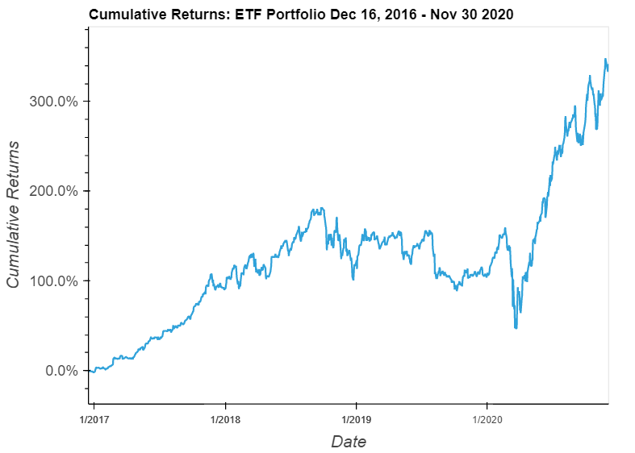

# Fintech ETF Analyzer

Jupyter Notebook that uses SQL and Pandas to analyze the performance of a hypothetical fintech ETF consisting of Greendot Corporation (GDOT), Goldman Sachs (GS), PayPal (PYPL), and Square Inc (SQ).  Performance is analyzed by calculating daily returns, annualized returns, and cumulative returns. Voila can be used as a web alternative to Jupyter Notebook for visualizations. 

## Technologies

The application uses the following technologies:

- Python 3.7
- [pandas](https://pandas.pydata.org/pandas-docs/stable/index.html)
- [Jupyter Lab](https://jupyter.org/)
- [PyViz (Holoviz)](https://hvplot.holoviz.org/)
- [SqlAlchemy](https://www.sqlalchemy.org/)
- [Voila](https://voila.readthedocs.io/en/stable/index.html)

## Installation Guide

```python

pip install numpy
pip install pandas
pip install matplotlib
conda install -c pyviz hvplot geoviews
pip install SQLAlchemy
conda install -c conda-forge voila

```

### Jupyter

The application is based on a Jupyter Notebook. The minimum required is a Jupyter Notebook but Jupyter Lab can be installed as well.  Please review the [Jupyter installation instructions](https://jupyter.org/install)

## Usage

### Startup

- Launch Jupyter
- Load **etf_analyzer.ipynb** and select **Run => Restart Kernal and Run all Cells** from the menu

For optional visualization using Voila:
- voila etf_analyzer.ipynb

### Inputs

Greendot Corporation (GDOT), Goldman Sachs (GS), PayPal (PYPL), and Square Inc (SQ) closing prices and daily return percentages between December 16th, 2016 and December 4th, 2020.

### Analysis Output Examples

The data was extracted from a SQLite database and loaded into pandas DataFrames where various types of analysis were conducted to determine the viability of the ETF:

- Daily return analysis
- Annualized return analysis
- Cumulative return analysis




## Brief Analysis Review

Annualized returns and cumulative returns were 43.83% and 341.83% respectively over the period December 16th, 2016 and December 4th, 2020.

## Contributors

- Jacob Rougeau

## License

MIT

